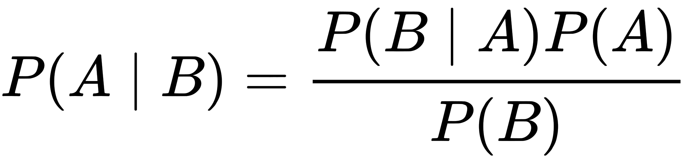

# bayesian-statistics
Overview of Bayesian statistics and its applications in machine learning

*References:*
- https://www.quantstart.com/articles/Bayesian-Statistics-A-Beginners-Guide
- https://en.wikipedia.org/wiki/Bayes%27_theorem
- https://www.probabilisticworld.com/calculating-coin-bias-bayes-theorem/

### Comparison of Frequentist and Bayesian statistics
- Frequentist statistics: The probability of observing a particular event is calculated by considering only how often it has happened in the past.
- Bayesian statistics: The probability of observing a particuluar event considers both how often it has happened in the past and the conditions associated with it happening (or not happening).

### Flipping a Coin
#### Interpretation of the Problem
- Frequentist interpretation:
  - No initial assumption is made about the system
  - The more we flip the coin, the more the ratio of heads to tails will trend towards the true distribution
- Bayesian interpretation:
  - An initial assumption is made about the coin (that it is fair)
  - The more we flip the coin, the more our posterior belief (current belief) is updated from our prior belief (that the coin is fair) in the presence of new information

#### Bayes' Theorem

- P(A) is the **prior**: This is the strength of our belief in A (how fair the coin is) without considering evidence B
- P(A|B) is the **posterior**: Updated belief of A once the evidence B (result of coin flip trials) has been taken into account
- P(B|A) is the **likelihood**: Probability of observing B given A (if we knew the coin was fair, how likely is any given outcome)
- P(B) is the **evidence**: This is the probability of B (a seqeunce of coin flips) occuring

#### Unfair Coin Flip Simulation

```Python
# Modules
from matplotlib.animation import FuncAnimation
import matplotlib.pyplot as plt
import numpy as np

# Parameters
coin_flips = 10000
heads_bias = 0.3

# Discretize possible biases of coin to heads
heads_biases = np.arange(0, 1, 0.01)

# Uniform probability density function prior
prior = np.ones(len(heads_biases)) / len(heads_biases)
pdfs = np.zeros((coin_flips, len(heads_biases)))
pdfs[0] = prior

# Flip coins and update priors
for flip in range(1, coin_flips):

    # P(B|A): Likelihood of flipped coin result for all possible biases of coin to heads
    likelihood = heads_biases if np.random.rand() < heads_bias else 1 - heads_biases

    # P(B): Evidence or overall probability of observing heads
    evidence = sum(likelihood * pdfs[flip - 1])

    # P(A|B): Posterior probability distribution after observing the coin flip
    pdfs[flip] = (likelihood * pdfs[flip - 1]) / evidence

# Set up figure to be animated
fig, ax = plt.subplots()
ax.set_xlabel('Bias of Coin to Heads')
ax.set_ylim(0, 1)
line, = ax.plot(heads_biases, pdfs[0], 'r-', linewidth=2)

# Update plot for animation
def update(i):
    ax.set_title(f'Coin Flip {i}')
    line.set_ydata(pdfs[i])

# Save animated evolution of coin bias for heads probability density function
anim = FuncAnimation(fig, update, frames=[x**2 for x in range(100)], interval=100)
anim.save('bayes_coin_flipping.gif', dpi=80, writer='imagemagick')
```